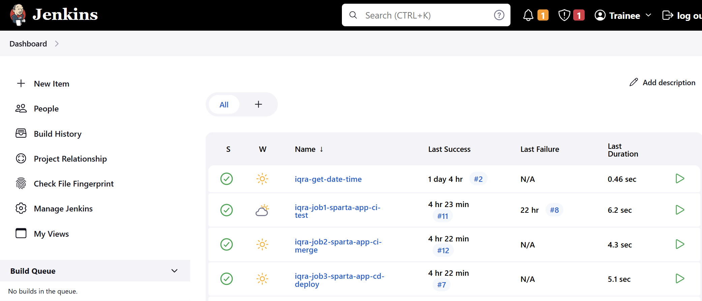
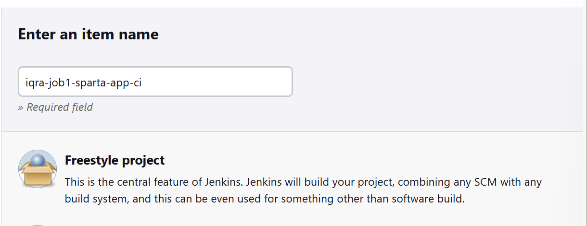
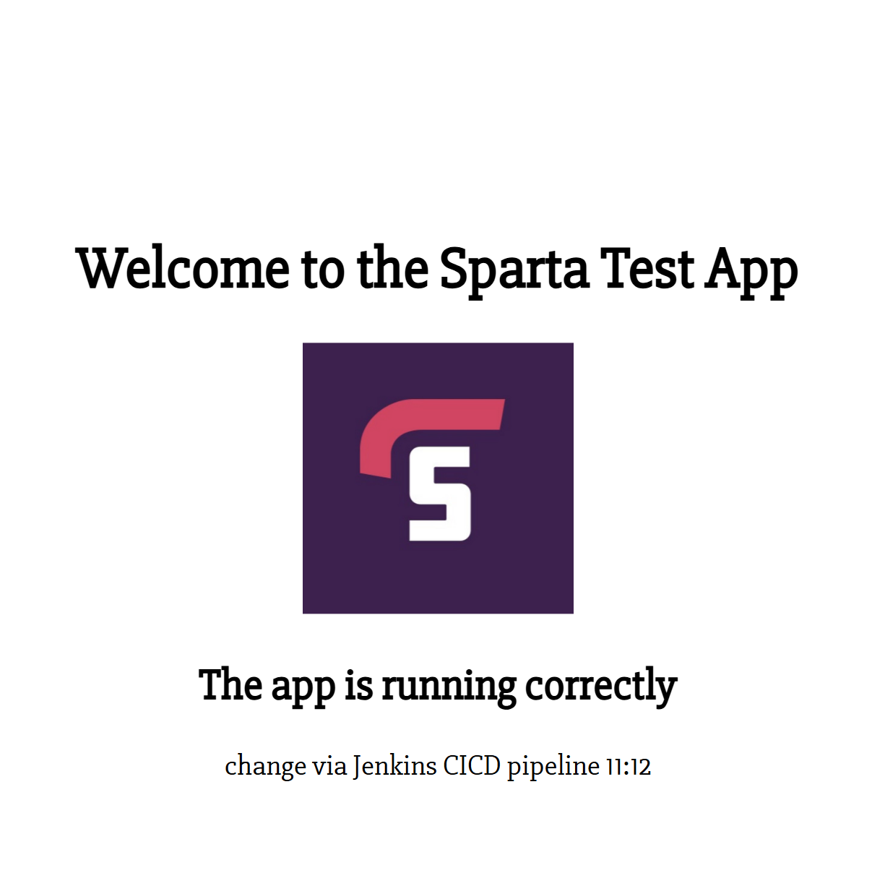

# Intro to Jenkins and CICD
- [Intro to Jenkins and CICD](#intro-to-jenkins-and-cicd)
  - [What is CI? Benifits?](#what-is-ci-benifits)
  - [What is CD? Benifits?](#what-is-cd-benifits)
  - [What is Jenkins?](#what-is-jenkins)
  - [Why use Jenkins?](#why-use-jenkins)
  - [Stages of Jenkins](#stages-of-jenkins)
  - [What alternatives are there for Jenkkins?](#what-alternatives-are-there-for-jenkkins)
  - [Why build a pipeline? Business value?](#why-build-a-pipeline-business-value)
- [Pipeline](#pipeline)
    - [What is a webhook in Jenkins?](#what-is-a-webhook-in-jenkins)
  - [Pipeline Architecture](#pipeline-architecture)
- [CI/CD pipeline in practice](#cicd-pipeline-in-practice)
- [setting up on jenkins](#setting-up-on-jenkins)
- [Job 1 - Test](#job-1---test)
  - [whats the point of this job?](#whats-the-point-of-this-job)
    - [key pair to connect jenkins to github](#key-pair-to-connect-jenkins-to-github)
    - [In Jenkins](#in-jenkins)
    - [credentials](#credentials)
  - [code](#code)
  - [webhook](#webhook)
- [Job 2 - Merge](#job-2---merge)
  - [What is the point of this job?](#what-is-the-point-of-this-job)
  - [setup](#setup)
  - [Using execute shell](#using-execute-shell)
  - [Using git publisher plugin](#using-git-publisher-plugin)
- [Job 3 - Deploy](#job-3---deploy)
  - [Whats the point of this job?](#whats-the-point-of-this-job-1)
  - [Set up](#set-up)
  - [Considerations](#considerations)
  - [Code](#code-1)
    - [If successful](#if-successful)
  - [why we dont need to git clone](#why-we-dont-need-to-git-clone)

## What is CI? Benifits?
- CI = Continuous Integration 
- merging code 
- triggered by: developers frequently pushing the code changes to shared repo 
- tests are run automatically on the code before it is integrated into the main code 

- Benifits:
  - help you to identify and resolve bugs 
  - helps to main a stable and functional software build

## What is CD? Benifits?
- CD can mean:
  -  Continuous Delivery(manual sign off.approval)
     -  ensure software is always in a deployable state, ready/can be pushed to production any time 
     -  often involved producing deployable artifact
     -  requires a manual release descion 
  
  - or continuous deployment (automatically deploys code to production)
    - extends continuous delivery by automating the final step of deployinf to production 
    - no manual intervention required 

- benifit which is also a disadvantage:
  - removes the human approval, relys entirly on automated processes 


## What is Jenkins?
- automation server 
- open-source
- primary used for CICD, but can automate much more 
## Why use Jenkins?
- Benifits:
  - automation 
  - extensibility: jenkins has over 1800 plugins 
  - scalability: jenkins server can scale easily by adding/using worker nodes/agents to run jobs
  - community support
  - cross-platform: works across windows, linux,MaxOS   

- Disadvantages 
  - can be complex for beginners
  - maintainance overhead:
  - resource-intensive when running multiple jobs 
  - user interface: outdated?

## Stages of Jenkins 
- a typical Jenkins CICD pipeline involves the following stages:
1. Source Code Management (SCM)
2. build: compile the code, build into execuatble artifact 
3. test: automated tests (units, integration, etc)
4. package: package into deployable artifact
5. (if using cont. deployment) the package is deployed into the target environment e.g. test, production
6. monitor: monitoring tools may be deployed/configured to observe performance, log issues, etc after deployment 

## What alternatives are there for Jenkkins?
- GitLab CI
- GitHub Actions 
- CircleCI
- TravisCI
- Banboo
- TeamCity
- GoGC
- Azure DevOps (azure pipelines to run the CICD pipelines)

## Why build a pipeline? Business value?
- cost savings -automating repetitive processes 
- faster time to marker 
- reduced risk 
- improved quality throough continuous feedback and improvement 


# Pipeline 


### What is a webhook in Jenkins?
- external services like Github can automatically notify Jenkins when something happens (e.g. git push)
- so Jenkins can trigger a job/pipeline without manual action 
  - stops the need for manual triggering


## Pipeline Architecture
```
Developer (dev branch)
    |
    | git push
    ↓
GitHub Repository ←──────────────┐
    |                             |
    | (2) Pull/receive repo       |
    ↓                             |
Jenkins Master ←─ (3a/3b) Webhook─┘
    |
    | Orchestrates jobs
    ↓
Agent Nodes
    |
    ├─→ Job 1: Test (dev branch)
    |       |
    |       | (4) if successful
    |       ↓
    ├─→ Job 2: Merge (dev → main)
    |       |
    |       | (5) if successful
    |       ↓
    └─→ Job 3: Deploy to EC2
            |
            | (5a) SSH with private key
            ↓
        EC2 Instance (running)

```


# CI/CD pipeline in practice
```
Developer
   |
   | (git push)
   v
Git Repository (dev branch)
   |
   | Webhook
   v
Jenkins Job 1 – CI (Test Dev)
   - Checkout dev
   - Build application
   - Run tests
   |
   | (on success)
   v
Jenkins Job 2 – CD (Promote to Main)
   - Checkout main
   - Merge dev → main
   - Optional smoke tests
   - Push updated main branch
   |
   v
Git Repository (main branch)
   |
   v
Updated Homepage / Application
```


- allows for really fast turnaround / feedback 
  - even if a bug falls through the cracks and is deployed the developer can add additional tests (unit tests, other tests) to resolve the bug 
    - the pipeline will initiate automatically, saving a lot of time in production


# setting up on jenkins 


- new item 
  - descriptive name e.g. `iqra-job1-app-ci-test`
  - freestyle proj 
  - save 


# Job 1 - Test
## whats the point of this job?
- runs the unit tests that are already in the app folder 
- makes sure that failing code is flagged and doesnt get pushed to main - theres less risk involved

- testing on the dev branch allows us to validate changes before they are pushed

### key pair to connect jenkins to github
- first thing is to connect your Github repo (with the app)
  - first generate new key pair `firstname-jenkins-2-github-key`
- open gitbash window and make way to ssh folder 
    - to generate new key pair `ssh-keygen rsa -b 4096 -C "personal email"`
    - type in the name of key (as above)
- in this case we want to attach it to the cicd repo with the app folder 
  - inside the repo click settings (NOT account settings, just the repo settings)
  - deploy keys 
  - title should be the exact name you called the key
  - `cat firstname-jenkins-2-github-key.pub`, this will bring up the contents of the PUBLIC key
  - copy and paste exactly onto github
  - allow write access
    - because in the merge job jenkins needs to push the changes back to the github repo + must have write access to do so 
  - add key


### In Jenkins 
- create the new item (job 1) + freestyle project



- `general` - give a description e.g. do testing part of CI, with webhook trigger 
- disguard old builds, set max to 5 in this case 
  - this can be increased depending on how much you personally need to track changes before they are deleted.
- check `github project`
  - project url is simply the HTTPS endpoint on the github repo
  - remember to remove the `.git` and replace it with a `/`

### credentials
- under source code management click git 
- repo url should be the SSH endpoint on github (nothing needs to be modified)
- add credentials 
  - kind = SSH username with private key (allows access to github repo)
  - ID = name of the key pair `firstname-jenkins-2-github-key`
  - username = `firstname-jenkins-2-github-key`
  - description = to read/write to repo
  - go to private key and enter directly- do the same cat command as before but this time with the private version
  - click add
- now credential should be in the drop down
- branche specifier = dev 
  - can test job 1 works first by just using main branch and changing later once confirmed
    - switching from main -> dev on gitbash 
      - `git branch dev`
      - `git checkout dev` or `git switch dev`


- build environment = provide node & npm bin/folder to PATH
  - nodeJS version 20

## code 
- build steps = execute shell 
```shell
cd app
npm install 
npm test
```

- `come back add post build actions when you have the proceeding job 2 made`


## webhook 

- under job 1 
  - build triggers 
    - Github hook trigger for GTScm polling
      - this ensures that jenkins is actually listening out for Github

- go back to github repo 
  - settings
  - webhooks
    - under payload url go to jenkin server url and copy and paste just the http://<ip address>/port
      - add /github-webhook/ to the end = `http://<ip address>/port/github-webhook/
    - add webhook

test it works by git pushing 

# Job 2 - Merge 

## What is the point of this job?
- promting the tested code to be used by production branch (main)
- it will automatically trigger if job 1 completes successfully

## setup
- can create a copy of job 1 and alter a few things 
- use the same ssh credential BUT
  - click ssh agent - prevents the priv key access from closing after checkout phase (cloning repo stage)
  - `Provide Node & npm bin/ folder to PATH` checkbox is not needed


## Using execute shell 
  -under build-steps change the execute shell code to merge code e.g. 
```shell
git checkout main
git pull origin main
git merge origin/dev
git push origin main
```
- go back to job 1 and add a post build action to allow job2 to proceed from job 1

## Using git publisher plugin 
- a simpler way to go about the same merge function is by using a git publisher plugin 
- instead of selecting the execute shell under build-steps, go to post build actions and click `Git Publisher`
  - check:
    - `push only if build succeeds `
    - `merge results`
  - under branches:
    - `branch to push` : main
    - `target remote name`: origin 


# Job 3 - Deploy 

## Whats the point of this job?
- this is the point of continuous deployment 
- exists to separate code promotion from runtime deployment

## Set up
- The basic details of this settup are the same as job 2 
- make sure to go back to job 2 to associate job 3 through post build actions

## Considerations

- make sure ec2 instance is built allowing traffic from anywhere - usual security group rules for app 
- make sure that the dependencies are run first 
  - e.g. nginx etc.
  - this can be done by using an image or by executing the prov.app script without the clone and start commands


## Code 
- this is the basic structure of the execute shell code 
- I chose to use a variable because it makes insertion clearer to me
```shell 
EC2_IP="<ec2 instance public ip>"

scp -r app ubuntu@$EC2_IP:/home/ubuntu/

ssh ubuntu@$EC2_IP << EOF
cd /home/ubuntu/app
npm install
pm2 delete sparta-app || true
pm2 start app.js -- name SpartaApp 
EOF

``` 
- `scp` - transfer the jenkins code to my EC2
- -`r` - recursive command to make sure everything inside the app folder is copied over 
        - i found that without this i would get an error
- `app` - the source folder for jenkins
- `ubuntu@$EC2_IP:/home/ubuntu/` - destination on EC2

- `-- name SpartaApp`- Ive found that adding a name to the app helps identify it in the process lists if issues arise

optional:

```shell
scp -o StrictHostKeyChecking=no -r app ubuntu@$EC2_IP:/home/ubuntu/
```
- `-o StrictHostKeyChecking=no`- essentially just skips the "Are you sure you want to continue connecting?" when you first ssh in 
  - this doesnt matter if you arent ssh-ing for the first time


- changes can be made to the app e.g. adding a line `change via Jenkins CICD pipeline` by:
  - cd to app folder 
    - inside app make way to `/app/views`
    - `nano index.ejs`
  - make whatever change is needed
  - save and push as usual 

### If successful



## why we dont need to git clone
- the reason we dont git clone in the ec2 is for a few reasons:
  - the test (job 1), clones the app from github and tests it - this is the most up-to-date version
    - changes are pushed to main but we dont clone from main either 
  - Job 3 will send over to ec2 from Job1s workspace where the app is cloned to and has been tested. if someone else was pushing changes at the same time as you, it might lead to the ci/cd overlapping